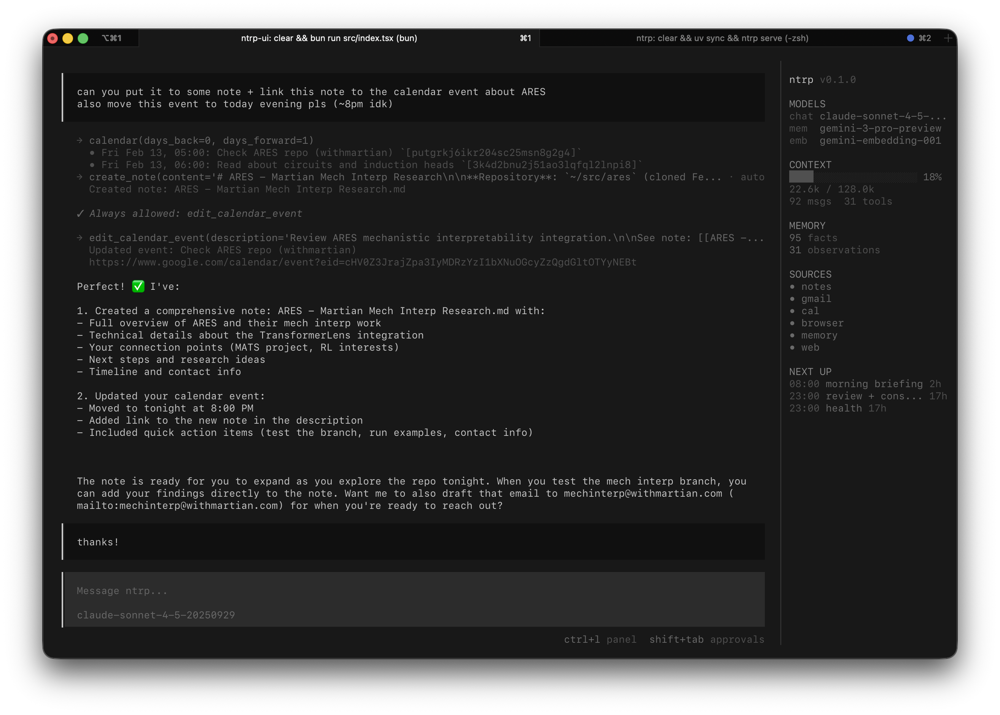

# NTRP

Personal assistant with persistent memory, scheduling, and multi-source knowledge integration.



## How to Run

```bash
# Install
git clone https://github.com/esceptico/ntrp.git
cd ntrp
uv sync
cd ntrp-ui && bun install && cd ..

# Configure
cp .env.example .env
# Edit .env — set at least one LLM key and the model variables

# Start
uv run ntrp serve              # backend
cd ntrp-ui && bun run src/index.tsx  # UI
```

**Headless mode**:
```bash
uv run ntrp run -p "your prompt here"
```

**Docker**:
```bash
cp .env.example .env  # set your API keys
docker-compose up -d
```

See [docs/setup.md](docs/setup.md) for detailed setup instructions (Google OAuth, Telegram, Obsidian, etc).

## Features

- **Memory** - Remembers facts and patterns across conversations
- **Scheduling** - Run tasks at specified times with email notifications
- **Sources** - Obsidian notes, browser history, Gmail, Calendar, web search

## License

MIT
