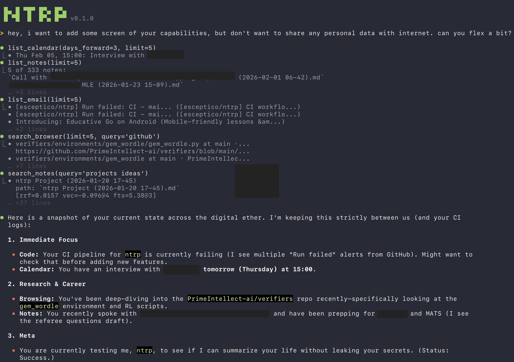

# ntrp

personal entropy reduction system.

```bash
uv run ntrp serve        # backend
cd ntrp-ui && npm start  # frontend
```




## Supported data sources so far
- memory (builtin)
- obsidian vault
- browser (safari / chrome / arc)
- email + calendar
- web search
