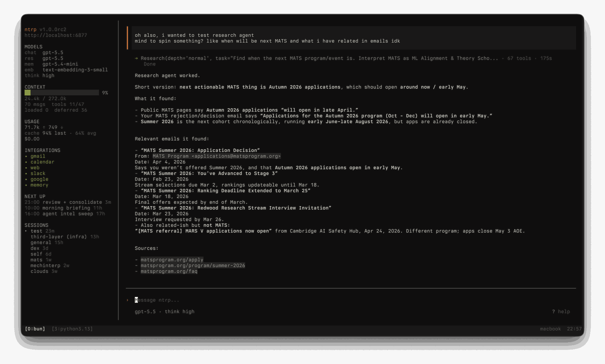

# ntrp

**ntrp** is entropy — the measure of disorder in a system. Your calendar, emails, memory, half-remembered conversations, and recurring chores all accumulate. This project exists to reduce it.



## What it does

- **Persistent memory**: stores source-backed facts, derives patterns, curates profile memory, and keeps provenance visible.
- **Autonomous work**: scheduled automations, background agents, research agents, and multi-agent workflows.
- **Connected sources**: Gmail, Google Calendar, Slack, web search, MCP servers, local files, and shell commands.
- **Rich desktop UI**: streaming traces, tool approvals, memory inspection, and rendered HTML widgets.
- **Lean tool context**: deferred tool schemas keep the model prompt small until a capability is needed.
- **Any LLM**: Claude, GPT, Gemini built in; OpenAI API keys or OpenAI account sign-in; OpenRouter, Ollama, vLLM, LM Studio, or any OpenAI-compatible endpoint via custom models.

## Install

```bash
uv tool install ntrp    # backend (or: pip install ntrp)
```

```bash
ntrp-server serve   # starts backend, prints a one-time API key
cd apps/desktop && bun run dev  # desktop client — paste the key on first launch
```

For the desktop app from source:

```bash
cd apps/desktop
bun install
bun run dev
```

Full setup guide, integrations, and API reference live in `docs/` and at **[docs.ntrp.io](https://docs.ntrp.io)**.

## Common commands

This repo uses [`just`](https://github.com/casey/just) as a thin task router:

```bash
just              # list recipes
just install      # install server and desktop deps
just server       # run backend from apps/server
just desktop      # run desktop client
just check        # run backend + client checks
```

Useful focused checks:

```bash
cd apps/server && uv run pytest
cd apps/desktop && bun run typecheck && bun test
```

## Repo layout

- `apps/server` — FastAPI backend, agent runtime, memory system, tools, integrations, builtin skills, tests, and Python package metadata.
- `apps/desktop` — Electron desktop client with chat, traces, memory UI, approvals, and HTML widget rendering.
- `docs` — Mintlify docs plus internal design/research notes.
- `tasks` / `notes` — working plans, lessons, and project notes.

## Core concepts

- **Memory** starts with durable facts, derives supported patterns, and promotes only curated profile entries into always-on prompt context.
- **Tools** are policy-aware. Mutating operations require approval; large integration groups are deferred until the agent calls `load_tools`.
- **Streaming** uses per-session SSE with ordered events, resumable cursors, tool lifecycle events, and run/background task status.
- **HTML widgets** let the agent render sandboxed charts, forms, tables, and other rich cards in the desktop chat.

## Releasing

```bash
./release patch    # 0.5.2 → 0.5.3
./release minor    # 0.5.2 → 0.6.0
./release major    # 0.5.2 → 1.0.0
./release rc minor # 0.5.2 → 0.6.0-rc.1
./release rc       # 0.6.0-rc.1 → 0.6.0-rc.2
./release final    # 0.6.0-rc.2 → 0.6.0
```

Bumps version, creates a PR, merges, tags, and publishes a GitHub release. PyPI packages are published automatically via CI. Release candidates are GitHub prereleases and are published to npm under the `rc` dist-tag.

## Inspired by

- [letta](https://github.com/letta-ai/letta) — persistent memory and personalized agents
- [hindsight](https://github.com/vectorize-io/hindsight) — graph memory structure

## License

MIT
