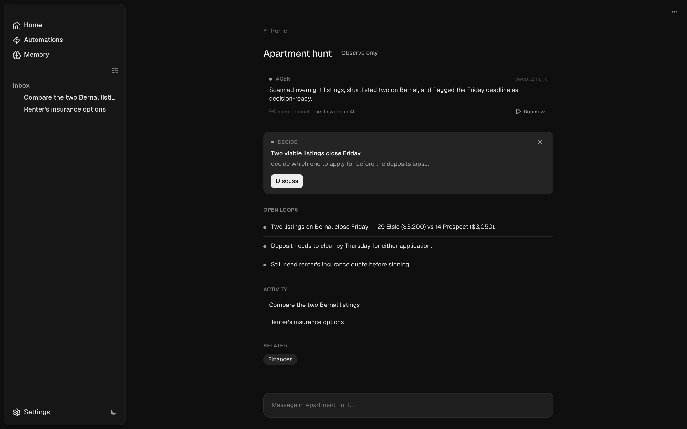

# ntrp

Entropy is the measure of disorder in a system. Your calendar, inbox, apartment hunt, health goals, and recurring chores all accumulate it. ntrp is a personal assistant that tries to reduce it.

It's a Python backend and an Electron desktop app, both running locally. It's not a coding agent. It's a place to keep the moving parts of your life in one system that remembers them and tells you what needs you.


## Slices

A slice is a domain of your life: apartment hunt, health, a side project, finances. Each one is backed by a memory topic page and watched by a standing agent. The agent runs on a schedule, keeps the page up to date, and raises at most one ask when something actually needs you.

Home is where you land. It has a composer, the focus set (each slice's current ask, in one list), and a strip of your slices.

A few things worth knowing:

- The agent's job is to pick the single most important thing in its domain, or say nothing. A quiet slice is fine. It doesn't invent work to look busy.
- You don't register slices by hand. A daily job reads the topic pages in your memory that look like real life domains and suggests them on Home. One click promotes a suggestion into a slice; dismiss it and it won't come back.
- Open a slice to get its room: open loops, the agent's last run, the ask with a Discuss button, related slices, and a composer. Chats you start there already know the slice's page.

<table>
<tr>
<td width="50%"></td>
<td width="50%"></td>
</tr>
<tr>
<td align="center"><em>A slice room</em></td>
<td align="center"><em>The topic pages slices are built on</em></td>
</tr>
</table>

## Everything else

- **Memory.** Durable, source-backed records that get synthesized into readable topic pages. Provenance stays visible; recall is keyword plus semantic.
- **Automations.** Scheduled tasks, background agents, channel automations, and multi-agent workflows. Slice agents are just automations, so you can edit, pause, or reschedule them like the rest.
- **Structured output.** Pass a schema and an agent run hands back a validated object instead of text you have to parse. This is how a slice agent nominates its one ask.
- **Tool scoping.** Any automation can carry an allowlist of tool-name patterns that caps what its runs can touch.
- **Sources.** Gmail, Google Calendar, Slack, web search, MCP servers, local files, shell, and notifications.
- **Desktop UI.** Streaming traces, tool approvals, a memory browser, integration setup flows, MCP config, and sandboxed HTML widgets.
- **Any model.** Claude, GPT, Gemini, OpenRouter, Ollama, vLLM, LM Studio, other OpenAI-compatible endpoints, or an OpenAI sign-in through the Codex provider.


## Install

### Backend package

```bash
uv tool install ntrp    # or: pip install ntrp
ntrp-server serve       # starts backend, prints a one-time API key
```

The backend package does **not** include the desktop source tree. Use a source checkout for the Electron app.

### Desktop from source

```bash
git clone https://github.com/esceptico/ntrp.git
cd ntrp
just install
just server      # terminal 1
just desktop     # terminal 2
```

Or run the desktop directly:

```bash
cd apps/desktop
bun install
bun run dev
```

Paste the server API key on first launch. If no model provider is configured, the desktop onboarding flow lets you connect one.

Full setup guide, integrations, and API reference live in `docs/` and at **[docs.ntrp.io](https://docs.ntrp.io)**.

## Common commands

This repo uses [`just`](https://github.com/casey/just) as a thin task router:

```bash
just              # list recipes
just install      # install server and desktop deps
just server       # run backend from apps/server
just desktop      # run desktop client
just check        # run backend tests and desktop typecheck
```

Useful focused checks:

```bash
cd apps/server && uv sync --extra dev && uv run pytest
cd apps/desktop && bun run typecheck && bun test
```

## Repo layout

- `apps/server`: FastAPI backend, agent runtime, memory, slices, tools, integrations, builtin skills, tests, package metadata.
- `apps/desktop`: Electron client with Home, slice rooms, chat, traces, memory, approvals, settings, integrations, MCP, and widgets.
- `docs`: Mintlify docs plus internal design and research notes.
- `tasks`, `notes`: working plans, lessons, project notes.

## Releasing

```bash
./release patch    # 0.5.2 → 0.5.3
./release minor    # 0.5.2 → 0.6.0
./release major    # 0.5.2 → 1.0.0
./release rc minor # 0.5.2 → 0.6.0-rc.1
./release rc       # 0.6.0-rc.1 → 0.6.0-rc.2
./release final    # 0.6.0-rc.2 → 0.6.0
```

Bumps version, creates a PR, merges, tags, and publishes a GitHub release. PyPI packages are published automatically via CI. Release candidates are GitHub prereleases.

## Inspired by

- [letta](https://github.com/letta-ai/letta) for persistent memory and personalized agents
- [hindsight](https://github.com/vectorize-io/hindsight) for graph memory structure

## License

MIT
