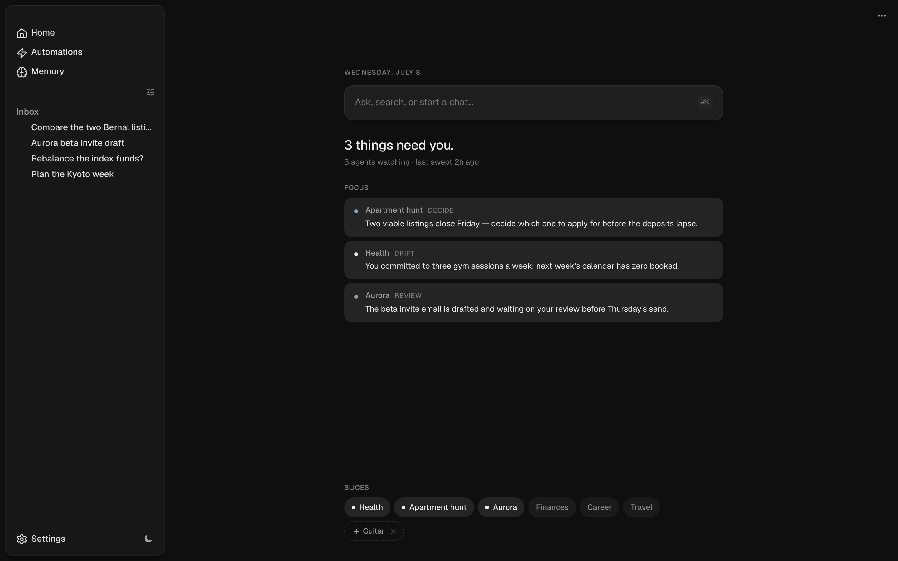

# ntrp

A local-first personal assistant. Not a coding agent: a place to keep the moving parts of your life in one system that remembers them and tells you what needs you. Python backend, Electron desktop app.



Details, screenshots, and the API reference live in `docs/` and at **[docs.ntrp.io](https://docs.ntrp.io)**.

## Install

```bash
uv tool install ntrp    # or: pip install ntrp
ntrp-server serve       # starts the backend, prints a one-time API key
```

The package doesn't include the desktop app. For that, use a source checkout:

```bash
git clone https://github.com/esceptico/ntrp.git
cd ntrp
just install
just server      # terminal 1
just desktop     # terminal 2
```

Paste the API key on first launch.

## Commands

```bash
just              # list recipes
just install      # install server and desktop deps
just server       # run backend
just desktop      # run desktop client
just check        # backend tests + desktop typecheck
```

## Layout

- `apps/server`: FastAPI backend, agent runtime, memory, slices, tools, integrations.
- `apps/desktop`: Electron client.
- `docs`: Mintlify docs and internal notes.

## License

MIT
