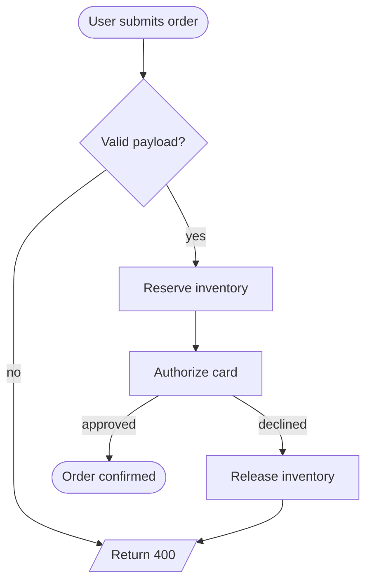

# Mermaid Diagram

## Workflow

1. **Pick the diagram type** from the table below.
2. **Read the matching reference file** with `ReadFile` for syntax details and examples — *only* the file you actually need, to keep context small.
3. **Emit a single fenced ```mermaid block** with the diagram. No prose unless the user explicitly asked for an explanation.

## Type → reference

| The user asks about… | Type | Reference |
| --- | --- | --- |
| processes, decisions, branches, "how does X flow" | flowchart | `<skill_path>/references/flowchart.md` |
| API calls, RPC traces, who-talks-to-whom over time | sequence | `<skill_path>/references/sequenceDiagram.md` |
| OO model, inheritance, fields/methods, UML | class | `<skill_path>/references/classDiagram.md` |
| state machines, lifecycles, transitions | state | `<skill_path>/references/stateDiagram.md` |
| database schema, FK relationships | ER | `<skill_path>/references/erDiagram.md` |
| project plan, deadlines, dependencies | gantt | `<skill_path>/references/gantt.md` |
| brainstorm tree, hierarchy without arrows | mindmap | `<skill_path>/references/mindmap.md` |

If the user asks for a diagram type not in the table (`gitGraph`, `pie`, `quadrantChart`, `xychart-beta`, `sankey-beta`, `C4Context`, `architecture-beta`, `kanban`, `journey`, `timeline`, `requirementDiagram`), Mermaid supports it — emit the diagram using your knowledge of the syntax. Reach for [the official docs](https://mermaid.js.org/intro/syntax-reference.html) only if you're unsure.

## Output rules — applies to every diagram

- **One** fenced ```mermaid block. No prose inside the fence.
- The first non-blank line is the type keyword (`flowchart TD`, `sequenceDiagram`, …).
- Indent with two spaces. One statement per line.
- Quote any label containing punctuation: `A["GET /users"] --> B`.
- Use `<br/>` for line-breaks inside labels — not `\n`.
- Use **semantic IDs** (`UserService`, not `n1`).
- Keep labels short. Long labels make the layout explode.
- **Do not** add `%%{init:…}%%` directives or YAML frontmatter — the renderer already applies the project palette (mermaid `neutral` theme + transparent fills + monospace text). Override only if the user specifically asks.
- For accents on individual nodes, prefer top-level `classDef` over inline styles (hex colors only — Mermaid ignores CSS color names).
- Break a 30-node monster into 2–3 focused diagrams. Readability beats completeness.

## Quick example


