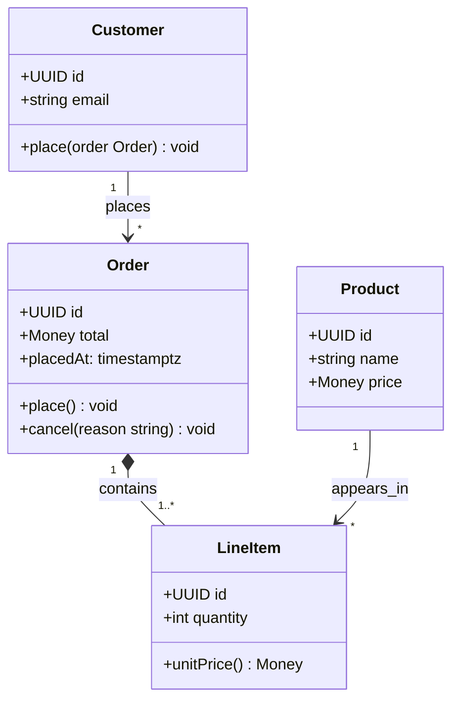

# Class Diagram

For UML / OO model: classes, inheritance, fields, methods, associations.

## Skeleton

```
classDiagram
  class User {
    +UUID id
    +string email
    +login() bool
    -hashPassword(raw string) string
  }
```

- `+` public, `-` private, `#` protected, `~` package.
- Methods include `()`. Static members get a `$`: `+static getInstance()$ User`.
- Abstract members get a `*`: `+render()* void`.

## Members

Two equivalent forms:

```
User : +UUID id
User : +login() bool
```

```
class User {
  +UUID id
  +login() bool
}
```

The block form scales better.

## Relationships

| Syntax | Meaning |
| --- | --- |
| `A <\|-- B` | B inherits from A |
| `A <\|.. B` | B implements A (interface) |
| `A *-- B` | A composes B (whole-part, owned) |
| `A o-- B` | A aggregates B (whole-part, shared) |
| `A --> B` | A points to B (association / dependency) |
| `A ..> B` | dependency (dashed) |
| `A -- B` | undirected link |

Note the `<|--` reads "B is-a A" (arrow points at the parent).

## Multiplicity & labels

```
Customer "1" --> "*" Order : places
Order "1" *-- "1..*" LineItem : contains
```

Quote multiplicities. Label after a `:`.

## Generics & types

```
class Repository~T~ {
  +findById(id UUID) T
  +save(item T) void
}
class UserRepo
UserRepo --|> Repository~User~
```

`~T~` declares a type parameter; you can reference it in method signatures.

## Notes

```
note for User "Email is unique"
note "Authentication module" as N1
N1 .. User
```

## Common pitfalls

- A `:` inside a class block ends the field — wrap descriptions in the label position only.
- Mermaid doesn't render method bodies. Keep signatures self-explanatory.
- Inheritance arrows look counter-intuitive: `Animal <|-- Dog` means **Dog** inherits from **Animal**.
- For more than ~10 classes, group by domain into multiple diagrams instead of cramming.

## Example


