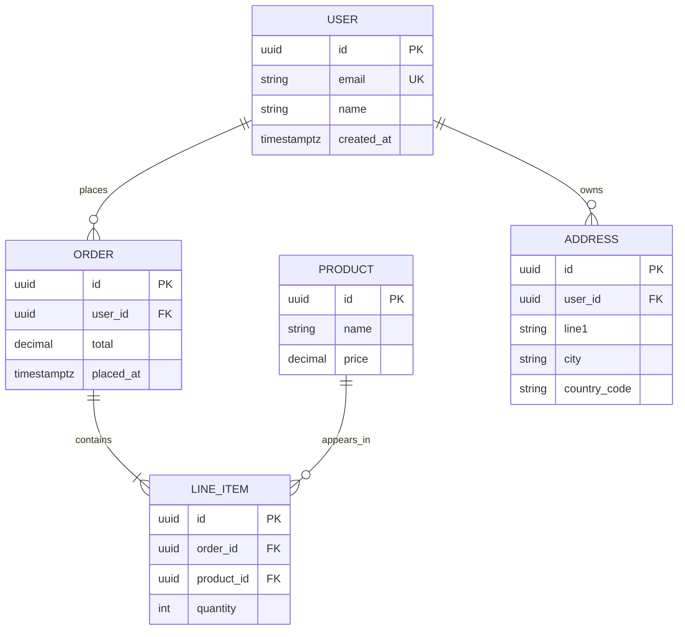

# ER Diagram

For database schema and entity-relationship modeling.

## Skeleton

```
erDiagram
  USER ||--o{ ORDER : places
  USER {
    uuid id PK
    string email UK
    string name
  }
  ORDER {
    uuid id PK
    uuid user_id FK
    decimal total
    timestamptz placed_at
  }
```

- Entity names are conventionally **UPPERCASE** in ER syntax.
- Each entity declares attributes inside `{ ... }`.

## Relationship cardinality

The arrow has two ends; each end describes one side's cardinality.

| Left end | Right end | Reads as |
| --- | --- | --- |
| `\|\|` | `\|\|` | exactly one to exactly one |
| `\|\|` | `o\|` | one to zero-or-one |
| `\|\|` | `o{` | one to zero-or-more |
| `\|\|` | `}\|` | one to one-or-more |
| `}o` | `o{` | zero-or-more to zero-or-more |
| `}\|` | `\|{` | one-or-more to one-or-more |

Examples:

```
USER ||--o{ ORDER : places           # one user places zero-or-more orders
ORDER ||--|{ LINE_ITEM : contains    # one order contains one-or-more items
PRODUCT ||--o{ LINE_ITEM : appears_in
```

The label after `:` is a verb phrase — read it across the arrow.

## Identifying vs non-identifying

Use `--` for identifying relationships, `..` for non-identifying:

```
USER ||--o{ ORDER : places       # identifying (solid line)
USER ||..o{ AUDIT_LOG : appears_in  # non-identifying (dashed)
```

## Attributes

```
USER {
  uuid id PK
  string email UK "lowercased"
  string name
  timestamptz created_at
}
```

- Type comes first, then name.
- Suffix keys: `PK`, `FK`, `UK` (unique).
- Quoted comments at end describe the column.

## Common pitfalls

- A relationship can only be declared **once** between a pair of entities. Multiple `USER ||--o{ ORDER : ...` lines render as one.
- Underscores are fine in entity names; spaces aren't — use `_` and let the prose label clarify (`USER_PROFILE`).
- Mermaid's ER renderer doesn't support diamonds for many-to-many; model them as a join entity (`USER ||--o{ FAVORITE }o--|| PRODUCT`).
- Don't include indices, defaults, or constraints in the diagram — keep it conceptual. Save those for migrations / DDL.

## Example


