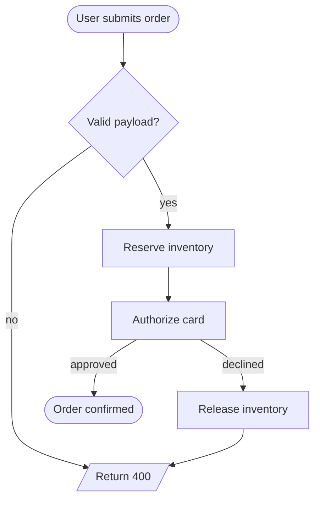
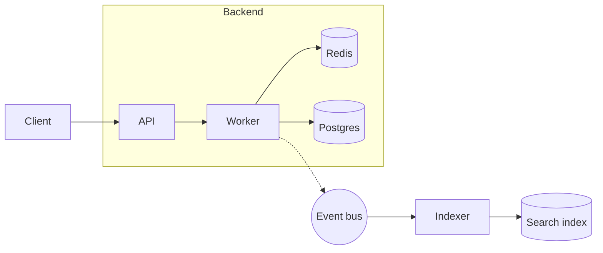

# Flowchart

For processes, decisions, pipelines, "how does X flow".

## Direction

Pick explicitly:

- `flowchart TD` (top-down) — vertical processes / decision trees.
- `flowchart LR` (left-right) — pipelines, data flows, request paths.
- `BT`, `RL` exist but rarely read better than the two above.

## Nodes

| Shape | Syntax | Use for |
| --- | --- | --- |
| rectangle | `A[Label]` | step / action |
| rounded | `A(Label)` | start / end / soft state |
| stadium | `A([Label])` | terminal — entry/exit |
| subroutine | `A[[Label]]` | reusable component / nested call |
| cylinder | `A[(Label)]` | database / store |
| circle | `A((Label))` | event |
| diamond | `A{Label}` | decision |
| hexagon | `A{{Label}}` | preparation |
| parallelogram | `A[/Label/]` | input / output |
| trapezoid | `A[/Label\]` | manual operation |

## Edges

- `A --> B` — arrow.
- `A --- B` — open line (no arrowhead).
- `A -.-> B` — dashed arrow (often "weak" or "async").
- `A ==> B` — thick arrow (use sparingly; pulls the eye).
- `A -->|label| B` — labeled edge.
- `A --> B & C` — fan-out.
- `A & B --> C` — fan-in.

## Subgraphs (clusters)

```
subgraph Storefront
  Web
  Cart
end
```

`subgraph` accepts an id and optional title:
```
subgraph backend [Backend services]
  API
  DB
end
```

## Styling

Always use `classDef` at the top of the diagram. Hex colors only.

```
classDef ok fill:transparent,stroke:#4f8a3a,color:#1a1a1a
classDef bad fill:transparent,stroke:#b8442b,color:#1a1a1a
class C,D ok
class Reject bad
```

Keep palette to ≤ 3 classes. The renderer handles the default look.

## Common pitfalls

- A label with parentheses, `:`, `[`, `]`, or arrows must be **quoted**: `A["GET /users (paginated)"]`.
- `&` in a label confuses the parser unless quoted.
- Self-loops use a labeled edge: `A -->|retry| A`. Don't draw them too often; they're noisy.
- Don't connect into the *interior* of a `subgraph` — connect to one of its members. Mermaid clusters re-flow.
- `linkStyle 0 stroke:#…` targets edges by index. Fragile if you add edges later — `classDef` is sturdier.

## Examples

### Order pipeline with a decision



### Service architecture with subgraphs


