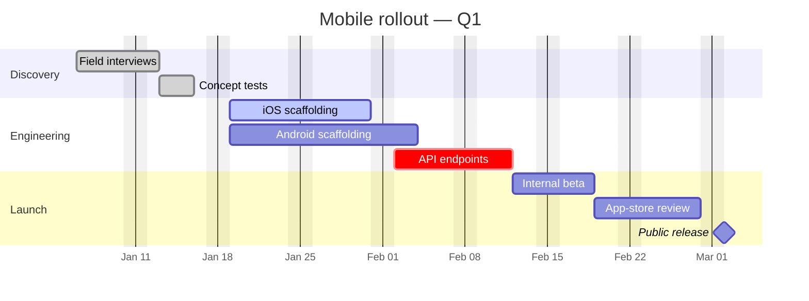

# Gantt Chart

For project plans, deadlines, dependencies on a timeline.

## Skeleton

```
gantt
  title Q1 launch plan
  dateFormat  YYYY-MM-DD
  axisFormat  %b %d
  section Discovery
    User research        :done,    res, 2026-01-06, 2026-01-17
    Spec write-up        :done,    spec, after res, 5d
  section Build
    API                  :active,  api, 2026-01-20, 12d
    Web                  :         web, after api, 10d
  section Launch
    QA                   :crit,    qa, after web, 5d
    Public release       :milestone, after qa, 0d
```

## Required header lines

- `title <text>` — diagram title.
- `dateFormat <pattern>` — how dates in tasks are parsed (e.g. `YYYY-MM-DD`).
- `axisFormat <pattern>` — how the time axis is displayed (e.g. `%b %d`, `%Y-%m-%d`).
- `excludes weekends` (optional) — skip Saturdays and Sundays.

Always set `dateFormat` first so subsequent dates parse.

## Tasks

```
Task name : [tags,] tag-id, start, duration-or-end
```

- `start` is a date in `dateFormat`, or `after <other-tag>` to chain after another task.
- Duration units: `d` (days, default), `w`, `h`, `min`. Or an absolute end date.

Examples:

```
Setup CI            : ci, 2026-01-12, 3d
Migrate DB          : after ci, 2d
Smoke tests         : crit, smoke, after migrate, 1d
Bug-bash            : 2026-02-01, 2026-02-05
```

## Tags

Place these comma-separated before the tag-id:

| Tag | Meaning |
| --- | --- |
| `done` | completed task — drawn in muted color |
| `active` | in-progress |
| `crit` | critical-path — drawn in alert color |
| `milestone` | a single point in time (use `0d` duration) |

Combine: `:crit, active, mig-1, after ci, 3d`.

## Sections

```
section Discovery
  ...
section Build
  ...
```

Sections are vertical groupings — render as horizontal swim lanes.

## Common pitfalls

- A task without an explicit start AND no `after` clause is a syntax error.
- `after` references the **tag-id**, not the human name. Naming convention: keep tag-ids short and unique (`ci`, `mig-1`, …).
- Mermaid can't model "starts no earlier than X **and** after Y" — pick one constraint.
- Long titles overflow the bar. If you have to use them, put detail in a `Note over` ... wait, gantt has no notes. Keep titles to ~24 chars.
- Weekend exclusion (`excludes weekends`) shifts subsequent `after`-chained tasks. Don't toggle it once tasks are written.

## Example


