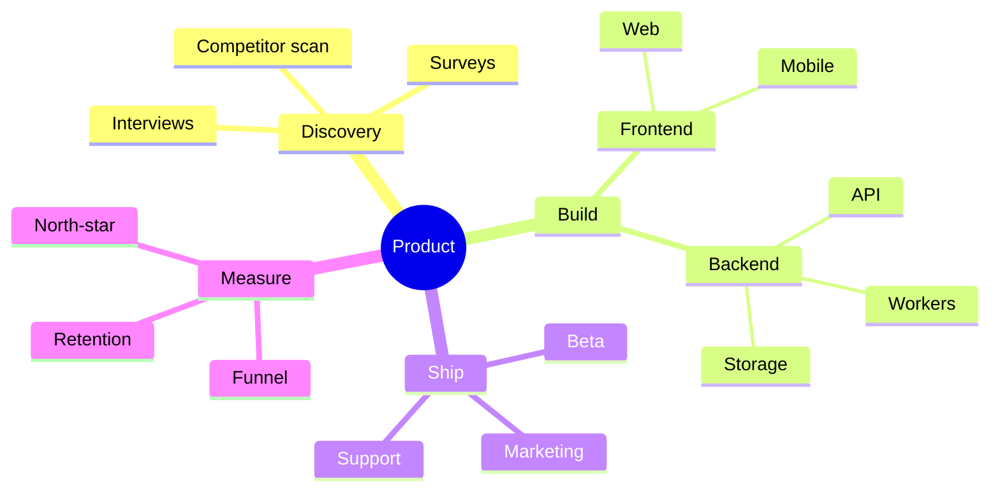

# Mindmap

For brainstorm trees, concept hierarchies, knowledge maps. Indentation defines parent / child.

## Skeleton

```
mindmap
  root((ntrp))
    Memory
      Facts
      Observations
      Dreams
    Tools
      Files
      Web
      Memory
    Skills
      Builtin
      Project
      Global
```

- The first entry under `mindmap` is the **root**.
- Each level below the root is one indent deeper. Indentation must be consistent — pick 2 or 4 spaces and stick with it.

## Node shapes

| Shape | Syntax | Reads as |
| --- | --- | --- |
| default | `Topic` | rounded |
| rounded | `Topic(Topic)` | same as default but explicit |
| pill | `Topic((Topic))` | central / important |
| hex | `Topic{{Topic}}` | preparation |
| cloud | `Topic)Topic(` | fuzzy / external |
| bang | `Topic))Topic((` | callout |
| square | `Topic[Topic]` | concrete component |

The label inside the brackets is what's displayed; the leading word can be anything but is conventionally the same.

## Icons & class

Mermaid mindmaps support `::icon(fa fa-<name>)` annotations and `:::className` for styling, e.g.:

```
mindmap
  root((Stack))
    Frontend
      ::icon(fa fa-react)
    Backend
      ::icon(fa fa-python)
```

Only enable these if you've shipped the icon font — otherwise omit.

## Common pitfalls

- Mindmaps **must** have a single root. Multiple top-level nodes raise a parse error.
- Indentation drift (mixing 2 and 4 spaces in the same diagram) breaks the layout.
- Long branches with many siblings render lopsided; balance the tree by re-grouping.
- Keep label text short — there's no automatic wrapping.
- Mindmap supports neither edges nor labels on edges — for those, switch to a flowchart.

## Example


