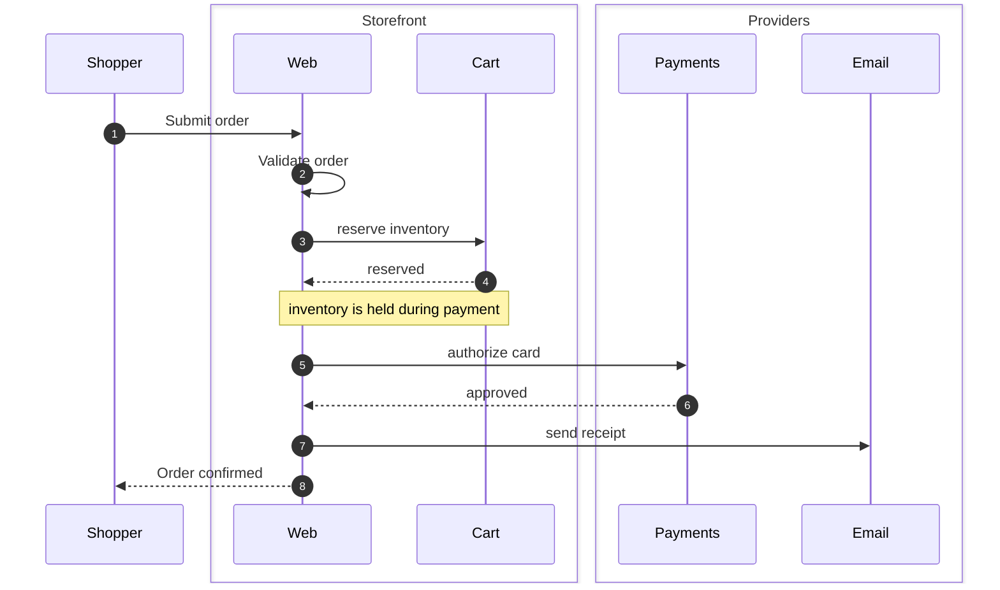

# Sequence Diagram

For API calls, RPC traces, who-talks-to-whom over time.

## Skeleton

```
sequenceDiagram
  autonumber
  participant Web
  participant API as "Order API"
  Web->>API: POST /orders
  API-->>Web: 201 Created
```

- The first non-blank line is `sequenceDiagram`.
- `autonumber` prefixes every message with a sequence number — turn it on if there are more than ~5 messages.
- Declare participants explicitly when you want a custom label or specific column order. If you skip the declaration, columns appear in the order participants are first mentioned.

## Participants

```
participant Web
participant API as "Order API"
actor Shopper
```

`actor` draws a stick figure instead of a box — use it for human roles.

For a custom label, quote it: `participant API as "Order API"`.

## Grouping participants

```
box Storefront
  participant Web
  participant Cart
end
box Providers
  participant Payments
  participant Email
end
```

The `box` directive draws a labeled frame around a set of participants. Avoid color tokens (`box rgb(...)`) — they fight the renderer's palette.

## Messages (arrows)

| Syntax | Meaning |
| --- | --- |
| `A->>B: msg` | solid forward call |
| `A-->>B: msg` | dashed return |
| `A->B: msg` | open arrow (no head) |
| `A-->B: msg` | open dashed |
| `A-)B: msg` | async (dotted with open arrow) |
| `A->>+B: msg` | call **and** activate B |
| `A-->>-B: msg` | reply **and** deactivate A |

Keep the convention: `->>` for forward, `-->>` for return. The renderer colors them differently.

## Notes

```
Note over Web: validating
Note over Web,Cart: inventory is held during payment
Note left of Web: optional context
```

Place a note `over`, `left of`, or `right of` one or more participants.

## Activation bars

```
Web->>+API: GET /me
API-->>-Web: 200 OK
```

The `+` activates the receiver, the `-` deactivates the sender. Activation bars show how long a participant is "busy".

Or use the explicit form:

```
activate API
Web->>API: GET /me
API-->>Web: 200 OK
deactivate API
```

## Control structures

- `loop until accepted … end` — repeat block.
- `alt success … else failure … end` — branching.
- `opt cache miss … end` — optional block.
- `par tasks in parallel … and … end` — parallel branches.
- `critical try … option … end` — critical section.
- `break on error … end` — breakout.

Don't nest more than two deep — flatten by splitting the diagram.

## Common pitfalls

- A blank `: …` after the arrow is required: `A->>B:` (with no message text) is fine; `A->>B` alone is a parse error.
- Arrow text: `:` ends after the *first* `:`. Subsequent colons are literal text.
- Long messages wrap badly. Use `<br/>` to force line breaks: `Web->>API: POST /orders<br/>{ "id": "abc" }`.
- Self-calls draw a curl: `A->>A: tick`. They take vertical space — group consecutive self-calls if you can.

## Example


