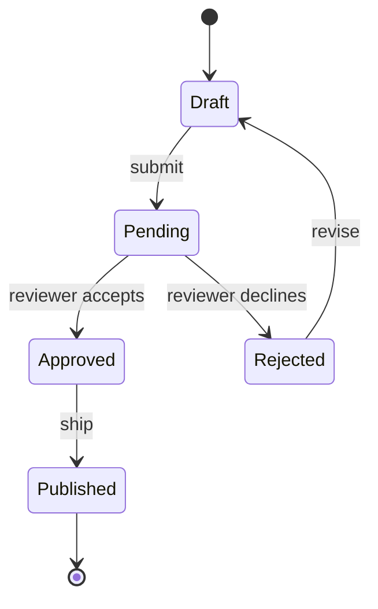

# State Diagram

For state machines, lifecycles, transitions. Always use the `-v2` variant — the older syntax is unmaintained.

## Skeleton

```
stateDiagram-v2
  [*] --> Idle
  Idle --> Running : start
  Running --> Idle : stop
  Running --> [*] : crash
```

- `[*]` is the start (when on the left of `-->`) or terminal (on the right).
- Transitions: `Source --> Target : trigger`.

## Composite (nested) states

```
stateDiagram-v2
  [*] --> Active
  state Active {
    [*] --> Heating
    Heating --> Cooling : threshold
    Cooling --> Heating : threshold
  }
  Active --> Off : powerOff
  Off --> [*]
```

`state Name { ... }` introduces a sub-machine. Composite states have their own `[*]` start/end.

For a custom display label use `state "Pretty Name" as N`:

```
state "Awaiting approval" as Pending
[*] --> Pending
```

## Forks, joins, choices

```
state fork_one <<fork>>
state join_one <<join>>
state c1 <<choice>>

[*] --> fork_one
fork_one --> A
fork_one --> B
A --> join_one
B --> join_one
join_one --> c1
c1 --> Approved : if score > 0.7
c1 --> Rejected : otherwise
```

`<<fork>>` and `<<join>>` model parallel branches; `<<choice>>` is a guarded conditional.

## Notes

```
note left of Idle : default state on boot
note right of Running
  Heavy computation
  happens here.
end note
```

Multi-line notes use the block form.

## Direction

By default vertical. Set explicitly inside a composite:

```
state Active {
  direction LR
  ...
}
```

## Common pitfalls

- Always use `stateDiagram-v2`. The plain `stateDiagram` keyword falls back to a deprecated renderer with worse layout.
- A state can only be defined once. Reusing a name across composite states is an error.
- Trigger labels go after `:`, e.g. `A --> B : timeout`. Don't put `:` in a state name.
- Orphan states (no transitions in or out) usually mean the model is incomplete — connect them or drop them.

## Example


