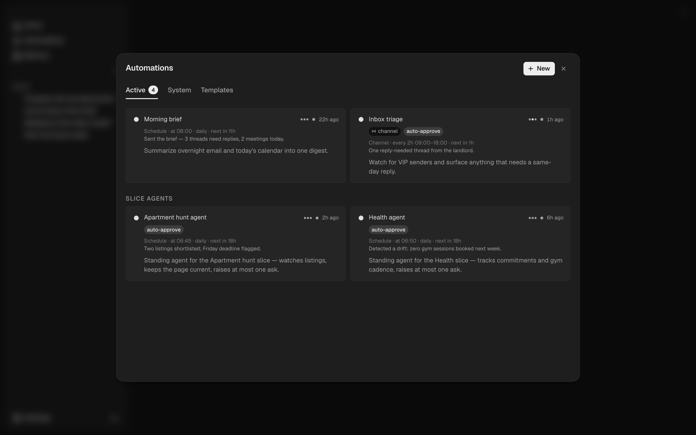

## Overview

Automations let ntrp act on its own — daily summaries, inbox monitoring, reminders, or any task you'd otherwise forget to do manually.

Each automation has one or more **triggers** (when to run), a **description** (what to do in natural language), and optional notification behavior through configured notifiers. When multiple triggers are defined, the automation fires when **any** trigger condition is met.



## Trigger types

### Scheduled

Run at a specific time, optionally on specific days:

```
Every weekday at 09:00 → "Summarize my unread emails and calendar for today"
Every day at 22:00 → "Review what I committed today and update my work log"
```

### Interval

Run repeatedly at a fixed interval, with optional time windows:

```
Every 2h → "Check for new emails from VIP senders and notify me"
Every 30m (09:00–18:00) → "Monitor the deployment pipeline status"
```

### Event-driven

Trigger before calendar events:

```
15 minutes before any meeting → "Pull up notes about attendees from memory"
```

### Idle

Fire once after a period of user inactivity. Resets when the user sends a new message.

```
After 5 minutes idle → "Extract facts from recent conversation"
```

### Count

Fire every N user messages in a session. The counter resets per session.

```
Every 10 turns → "Extract durable facts from the conversation"
```

## Channel automations

An automation can own a durable **channel session**. Its runs land in a real session whose transcript you can open, read, and reply to, and where approvals surface in-session. This is how iteration-style monitors and [slice agents](/guides/slices) keep run-to-run memory instead of starting fresh each fire.

## Tool scoping

An automation can carry a **tool scope**: an allowlist of tool-name patterns (`*`, an exact name, or `prefix*`) that bounds what its runs may touch, applied as a hard outer gate. A slice agent uses this to stay observe-only. See [tool scoping](/guides/tools#per-automation-tool-scoping).

## Structured output

An automation can declare a named **output schema**, so its run returns a validated object alongside its prose. See [structured output](/guides/tools#structured-output).

## Slice agents

[Slice agents](/guides/slices) are ordinary automations, seeded one per slice, with a channel, an observe-only tool scope, and the `slice_ask` output schema. They appear under **Slice agents** in the Active tab and can be edited, paused, rescheduled, or run like any other automation.

## Builtin automations

ntrp ships with system automations that run automatically, such as memory consolidation, synthesis, and the slice suggester. They appear in the **System** tab. What they do is fixed, but their schedule is yours: adjust the cadence, pause, or run now.

## Creating automations

### From chat

Use the automation tool in chat:

```
Create an automation that runs every weekday at 9am
to summarize my unread emails and today's calendar.
Notify me with the result.
```

### Via the API

```bash
curl -X POST http://localhost:6877/automations \
  -H "Authorization: Bearer $NTRP_API_KEY" \
  -H "Content-Type: application/json" \
  -d '{
    "name": "Morning briefing",
    "description": "Summarize unread emails and today's calendar events",
    "trigger_type": "time",
    "at": "09:00",
    "days": "weekdays"
  }'
```

Multi-trigger:

```bash
curl -X POST http://localhost:6877/automations \
  -H "Authorization: Bearer $NTRP_API_KEY" \
  -H "Content-Type: application/json" \
  -d '{
    "name": "Extract conversation facts",
    "description": "Extract durable facts from recent conversation",
    "triggers": [
      {"type": "count", "every_n": 5},
      {"type": "idle", "idle_minutes": 10}
    ]
  }'
```

## Approvals and permissions

By default, mutating or external actions still require approval. Toggle **auto-approve** only for automations you trust to run headlessly without per-call approval.

Examples that may need auto-approve:

- sending email
- posting to Slack
- creating calendar events
- writing files or updating external systems

## Notifications

Configure notifier destinations in **Settings → Notifications** or through the notifier API. Automations can use the `notify` tool to send results to configured channels such as Telegram, email, Slack, or shell commands.
