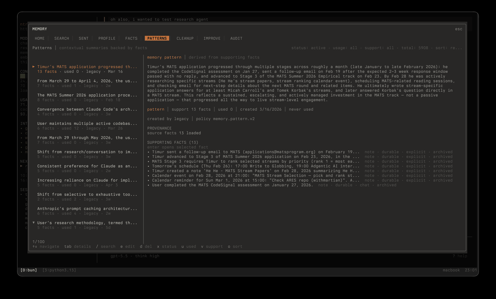
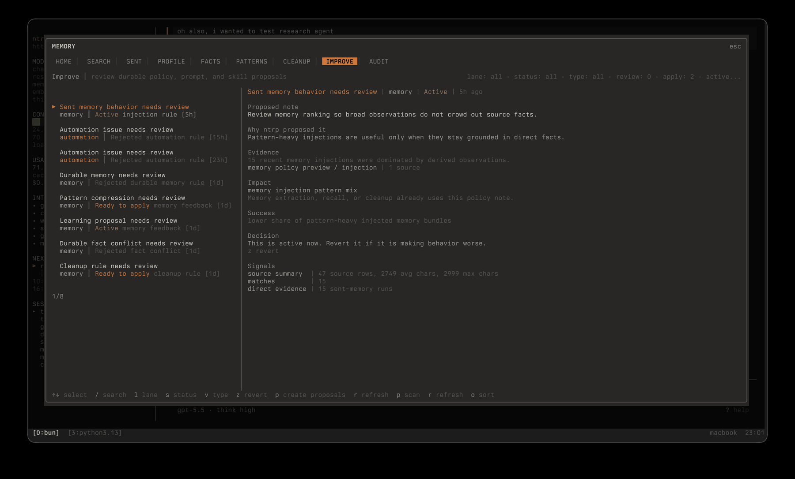

## Overview

ntrp keeps memory in layers instead of treating every extracted sentence as always-visible profile context.

```
source facts  ->  patterns  ->  profile entries
      |              |              |
      v              v              v
 searchable      derived        small always-on
 evidence        context        core memory
```

- **Facts** are the source-of-truth records extracted from chats, tools, and connected sources.
- **Patterns** are derived summaries over facts. In the API they are still called `observations`, but the UI calls them patterns because they are not raw truth.
- **Profile entries** are the only always-visible memory surface. They are curated, budgeted, and backed by direct fact or pattern provenance.
- **Learning proposals** are review-gated policy, prompt, skill, automation, or memory improvements. They never auto-apply silently.

Dreams are optional experimental cross-domain insights and are not part of the default memory navigation.

## Facts

Facts are durable evidence records. They carry text, source metadata, timestamps, entities, embeddings, access counts, and lifecycle state.

Facts should answer: "what concrete thing did ntrp observe or store?"

Examples:

- "The user prefers direct engineering feedback."
- "The Dex automation table mutation issue was discussed on May 1, 2026."
- "A calendar event named `morning briefing` runs daily at 08:00."

Facts are searchable and editable, but they are not automatically promoted into the prompt just because they mention the user.

## Patterns

Patterns are derived context built from supporting facts. They compress repeated or related evidence into a higher-level statement.

Patterns should answer: "what trend, repeated behavior, or durable relationship is supported by multiple facts?"

Examples:

- "The user tends to reject broad agent abstractions unless the data flow becomes simpler."
- "Recent backend work focused on reducing tool-schema prompt cost through deferred loading."

Patterns keep links to their source facts. They can be archived or regenerated without deleting the underlying evidence.

## Profile Entries

Profile entries are curated core memory shown to the agent by default. They should stay small and directly useful across unrelated sessions.

Profile entries should answer: "what should the agent almost always know before responding?"

Good profile entries:

- Stable identity, preference, relationship, or standing constraint.
- Short enough to fit in the always-on memory budget.
- Backed by source fact ids or pattern ids.

Bad profile entries:

- One-off tasks, current debugging state, temporary plans, or raw extracted facts.
- Generated summaries without direct provenance.
- Large biographies or project dumps.

## Write Path

When ntrp learns something new:

1. **Extract** durable source facts from user-visible evidence.
2. **Embed and index** facts for semantic and full-text retrieval.
3. **Link** entities and provenance.
4. **Consolidate** facts into patterns when there is enough support.
5. **Propose** profile or policy changes when memory feedback suggests a durable improvement.

Profile changes and continual-learning proposals stay review-gated. The system can propose them, but the user can inspect, approve, reject, edit, or archive them from the memory UI.

## Consolidation

Consolidation runs as a builtin automation with dual triggers: periodically and after idle time.

It performs narrow jobs:

- merge near-duplicate facts
- update or create supported patterns
- archive stale low-value records after dry-run review
- repair stale search indexes and missing embeddings
- record audit events for memory writes and automation outcomes

The goal is not to grow memory forever. The goal is better compression with clear provenance.

## Retrieval

For each prompt, ntrp combines:

1. profile entries that are always-on and budgeted
2. query-specific memory prefetch from facts and patterns
3. access telemetry showing which memory was retrieved, injected, omitted, or later corrected

This keeps profile memory small while still allowing context-specific recall.

## Continual Learning

The learning loop observes explicit feedback and runtime evidence, then creates reviewable proposals.

Current lanes include:

- **memory**: extraction, profile, compression, or cleanup policy notes
- **prompt**: bounded runtime prompt notes
- **skill**: proposed procedural skill improvements
- **automation**: automation scheduling or prompt behavior notes

Applying a proposal activates a bounded note for its lane. It does not rewrite source facts, edit skill files, or change schedules without an explicit action.

## TUI

Open `/memory` to inspect and control memory.



- **Home**: health, counts, and next actions
- **Search**: inspect query-time retrieval before it reaches the agent
- **Sent**: see what memory was injected into recent prompts/tools
- **Profile**: edit always-visible profile entries
- **Facts**: browse and edit source-of-truth records
- **Patterns**: inspect derived memory and supporting facts
- **Cleanup**: dry-run archival candidates before applying cleanup
- **Improve**: review continual-learning proposals
- **Audit**: answer why memory changed



## Agent Tools

- `remember`: store a durable fact with approval
- `recall`: search facts and patterns
- `forget`: delete or archive matching memory with approval
