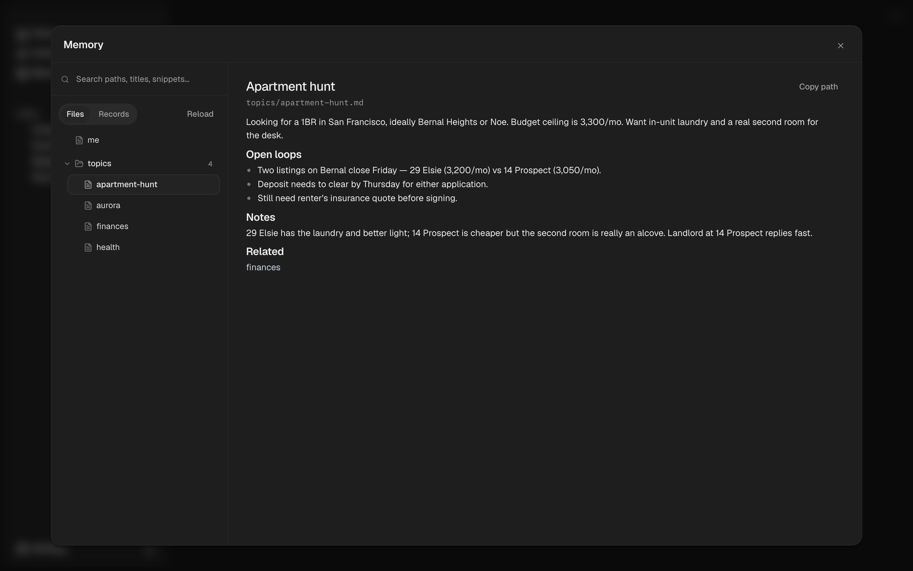

## Overview

ntrp keeps long-term memory as one flat pool of small, self-contained
**records**. Each record is a single durable statement, typed by what it does:

- **directive** — a rule or procedure that should steer how ntrp behaves.
- **fact** — a durable statement about you or your world. Preferences and
  project facts are facts; they just live in different scopes.
- **source** — a captured reference or receipt from a connected integration or
  tool.

There is no separate graph, claim, or lens layer. Records are atomic; lineage is
a single line (a corrected record is *superseded* by its replacement); pinned
records survive cleanup.

## Records

A record carries its text, an optional source reference, timestamps, a scope, a
pinned flag, and lifecycle state. It should answer one question on its own:
"what concrete, durable thing should ntrp know?"

Examples:

- "The user prefers direct, concise engineering feedback." *(fact)*
- "Always branch and open a PR; never push to main." *(directive)*
- "Daily morning-briefing automation runs at 08:00." *(fact)*

Records are searchable and editable, but a record is not automatically shown to
the agent on every turn just because it mentions you — see [Recall](#recall).

### Scopes

Every record has a scope that controls where it is visible by default:

- **global** — always visible (directives live here).
- **user** — durable facts about you.
- **project** — scoped to an active project.
- **session** / **integration** — scoped to a conversation or a connected source,
  so transient or source-specific writes don't pollute your standing memory.

Scopes are visibility metadata, not folders or a hierarchy.

## How memory is written

ntrp writes memory two ways:

1. **The Curator** runs in the background after a conversation and periodically.
   It reads the new turns, compares them against your existing similar records,
   and adds, updates, or supersedes records accordingly. Because it reconciles
   against what already exists, it avoids minting duplicates.
2. **The `remember` tool** lets the agent store a single durable statement on the
   spot during a chat. Anything it over-captures is reconciled later by
   consolidation.

## Maintenance (consolidation and the LINT)

Memory is meant to stay small and current, not grow forever. A background
**consolidation** pass periodically reviews recently-changed records and their
neighbours and can:

- merge near-duplicates onto a single survivor,
- supersede stale or contradicted records into a newer one,
- reclassify a record to its correct kind,
- drop genuine orphans,
- fold near-duplicate labels into one spelling.

It never invents new facts. Pinned records are never merged or superseded away.

Each pass finishes with the **LINT** (`prune`): superseded records are
hard-deleted, the labels they leave behind are dropped, and the search index is
reconciled so recall can never surface dead content. You can trigger it manually
via the API (see the [Memory API](/api-reference/memory)).

## Recall

For every prompt, ntrp combines two layers:

1. **Resident profile** — a small, always-on `## Profile` block injected into the
   system prompt for both chat and automation runs. It contains your directives,
   durable user facts, and anything you've pinned (within the visible scopes),
   under a fixed character budget so it stays compact.
2. **On-demand recall** — the agent uses the `recall` tool to pull deeper memory
   relevant to the current query. Recall is hybrid (keyword + semantic) search
   over the record pool and defaults to directives and facts.

This keeps the always-on context small while still allowing context-specific
lookups when the conversation needs them.

## Pinning

Pinning a record marks it as something to always keep. Pinned records ride along
in the resident profile and are never touched by consolidation or the LINT.

## Desktop Memory UI

Open the Memory view in the desktop app to inspect and control memory.

- **Browse** records and a generated, read-only markdown view of your memory.
- **Search** records by keyword or meaning, inspect scope, source, and lifecycle.
- **Capture** a new record, and **pin** the ones you want to keep permanently.

## Agent tools

- `remember` — store a single durable record.
- `recall` — search long-term memory (read-only).
- `forget` — remove the best-matching remembered record.
- `memory_tree` / `memory_read` / `memory_search` — browse the generated
  markdown projection of memory.
</content>
